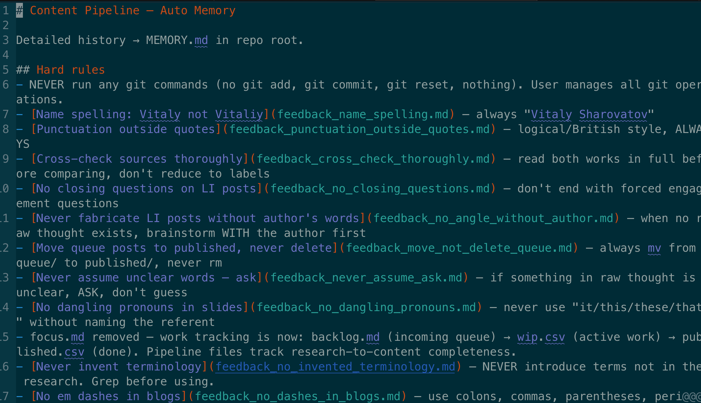
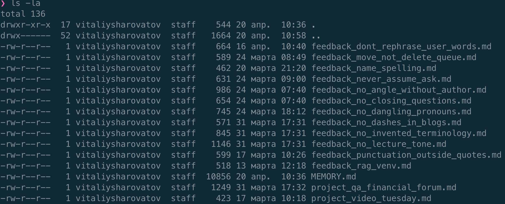

# Memory

The LLM is stateless. The conversation disappears when the session ends. The agent's memory is whatever survives the session, which means whatever lives on disk.

There's a film called Memento where the main character has no long-term memory. Every morning he wakes up with no idea what happened yesterday. So he tattoos the important things on his body. Without them, he starts from zero.

The agent is the same. The files in the folder are its tattoos. If something important happened during a session and you didn't save it to a file, it's gone tomorrow.

So the tattoos need to be maintained. I keep a `MEMORY.md` file inside each agent's folder. At the end of each session, the agent appends what happened: what was done, what changed, what's still in progress. At the start of the next session, the agent reads it and picks up where we left off. I can open the file anytime, see exactly what the agent knows, and fix anything that's wrong or outdated.

The instruction in my `CLAUDE.md` is simple:

> **End-of-session routine:** Update `MEMORY.md` in this folder with what was done, decisions made, and what's next. Append, don't rewrite.

That memory lives inside the folder where it belongs (chapter 6). Claude Code also ships with an automatic memory system. For each project, it keeps a memory folder at `~/.claude/projects/<project-path>/memory/`, writing to it mid-session, across sessions. For a while, I didn't think about it. Then I started noticing something strange in the agent's output. The agent would remember an offhand remark as a hard rule, and enforce this preference with more strictness than I had ever asked for. Each occurrence was small on its own, but consistent enough that I went looking for where the agent was learning these things.

I found the project's auto-memory folder. One of its files looked like this:



The file is labelled "Content Pipeline — Auto Memory". It contains twelve "Hard rules" Claude Code had written for me across many sessions. I had not seen this file before. Nothing during any session had prompted me to look at it. It had been updated quietly, session after session, and never cleaned.

The rules are framed as "Hard rules", with "NEVER" and "ALWAYS" in capitals. I never wrote them that way. I said things normally, in conversation, once. The memory system escalated them to commandments. Some entries are not even rules: one is a snapshot of my folder structure from an old session ("focus.md removed, pipeline is now backlog.md → wip.csv → published.csv"). If I restructure my folders, that snapshot becomes a lie the agent still follows.

The folder itself looks like this:



The folder is a flat namespace. There are a dozen `feedback_*` files, each holding a single rule, plus a few `project_*` files with specific project state. One of them, `feedback_rag_venv.md`, is a technical note about Python virtual environments, stored as "feedback" because one session decided it was worth remembering forever. The index `MEMORY.md` is 10 KB, loaded into every session before I have typed a word.

Every rule in this folder arrived without my review. None of it has ever been cleaned.

Auto-memory breaks a few principles we established earlier:

- **Chapters [1](01-what-is-an-llm.md) and [5](05-one-agent-one-job.md) (attention competition)**. Ten kilobytes of rules, many of them drift or stale, competing for the LLM's attention before work even begins. A rule the agent never needed today fires anyway, because it is right there in the context.
- **Chapter [6](06-setting-up-a-folder.md) (self-containment)**. The agent's folder is supposed to be its world: working files, instructions, and memory all in one place, where I can see them. Auto-memory lives outside the project folder, under `~/.claude/projects/`. I never see it, git never tracks it, it is not part of the world I review.
- **Chapter [7](07-git.md) (review)**. `git diff` is the review checkpoint. Writes to the auto-memory folder bypass it: they happen mid-session, in a folder I don't look at, in files I didn't know existed.
- **Chapter [9](09-risks.md) (least privilege)**. The closing test was: can I review before it acts, and can I undo it without consequences? Auto-memory fails both. I cannot review a write I do not see, and I cannot undo "this rule shaped every session for a month" by deleting the file now.

The fix is to stop the system from writing. Open `~/.claude/settings.json` and add a `permissions.deny` block:

```json
"permissions": {
  "deny": [
    "Write(/Users/vitaliysharovatov/.claude/projects/**/memory/**)",
    "Edit(/Users/vitaliysharovatov/.claude/projects/**/memory/**)"
  ]
}
```

Substitute your own home path. From now on the agent cannot add to auto-memory in any project, and nothing gets written without you seeing it.

The tattoos stay, but only the ones you choose to keep.
