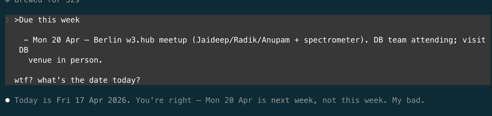

# Skills and scripts

In [chapter 3](03-lil-demo.md), I showed you my morning standup. I type "standup", the agent reads my event files, and it comes back with what's overdue, what's due this week, what's blocked, organised by event. It worked every morning.

Then one morning, it didn't.

The agent had today's date wrong, and the whole picture shifted by days: things that were overdue looked upcoming, and this week's deadlines looked like next week's.

Nothing on my side had changed. I hadn't touched CLAUDE.md, I hadn't renamed any files. The only thing different was the model: Anthropic had released Opus 4.7, and Claude Code had started using it.

Anthropic's [release note for 4.7](https://www.anthropic.com/news/claude-opus-4-7) says it directly:

> Instruction following. Opus 4.7 is substantially better at following instructions. Interestingly, this means that prompts written for earlier models can sometimes now produce unexpected results: where previous models interpreted instructions loosely or skipped parts entirely, Opus 4.7 takes the instructions literally. Users should re-tune their prompts and harnesses accordingly.

The model's maker is telling you the instructions you wrote for an earlier version will behave differently on the current one. This is a source of non-determinism you cannot see coming. You didn't change anything, and your workflow stopped working.

Model updates aren't the only source of non-determinism you cannot see coming. Context grows over the session ([chapter 1](01-what-is-an-llm.md)). CLAUDE.md accumulates over months. The LLM generates slightly differently every run. And now model versions update, and your instructions mean something different to the new version than they meant to the old. There will always be a source of non-determinism you didn't know to look at.

Every principle in this book so far has been a way to limit the damage when non-determinism strikes, not a way to prevent it:

- Splitting agents into one-per-job ([chapter 5](05-one-agent-one-job.md))
- Bounding each agent to its own folder ([chapter 6](06-setting-up-a-folder.md))
- Reviewing every change through git diff ([chapter 7](07-git.md))
- Scoping sessions to one task ([chapter 8](08-sessions.md))
- Granting only the access the agent needs ([chapter 9](09-risks.md))
- Scoping memory to the agent's folder ([chapter 10](10-global-memory.md))

None of these prevents non-determinism. All of them shrink what it can damage.

[Chapter 9](09-risks.md) was the **principle of least privilege**: assume the LLM will get things wrong, and limit what damage those mistakes can cause by limiting the agent's access.

This chapter starts from the same assumption and adds a complementary move: reduce where things can go wrong in the first place. This is the seventh engineering principle: **reduce the surface where non-determinism can act**. In security engineering, this is called [attack surface reduction](https://en.wikipedia.org/wiki/Attack_surface).

There are three approaches, each more aggressive than the last.

## Approach 1: separate files for data

My original CLAUDE.md included a list of the people I work with, their roles, and the contexts where they come up. Every session loaded it. Most sessions didn't need it.

I moved that list to `people.md`. CLAUDE.md now says: "For information about team members, read `people.md`". The list is still there, still accurate, still accessible. It just doesn't load by default. Fewer lines loaded into every session means a smaller surface for non-determinism to act on, and less competition for the LLM's attention ([chapter 5](05-one-agent-one-job.md)).

Any reference list, any lookup table, any catalogue of things you occasionally need but don't need every session: move it out.

## Approach 2: skills for procedures

Procedures were a bigger problem. Standup instructions. Budget rules. Email drafting tone. Evaluation procedures for new sponsorships. They all sat in CLAUDE.md, and they all loaded every session.

Claude Code has a feature called **skills**. A skill is a folder with its own instructions, invoked by a slash command. I built `/standup`, `/budget`, `/report`, and a few others. When I type `/standup`, the skill's instructions load. When I don't, they don't.

My CLAUDE.md shrank a lot. It now contains only what applies to every session: who the agent is, where things live, the end-of-session routine. Everything procedural moved into skills.

As in approach 1, fewer instructions load by default. Procedures are usually much longer than reference data, so this approach cuts more from the default context.

## Approach 3: deterministic scripts

The third approach is the biggest: it doesn't just reduce the LLM's surface, it removes the LLM from that step entirely.

My `/standup` skill, originally, worked like this: the agent reads every event file, parses dates and statuses, cross-references today's date, and composes a todo list. Every step is done by the LLM, every time I run standup. That's four places where non-determinism can slip in: reading, parsing, cross-referencing, composing.

But none of those steps needs judgement. Reading files, parsing dates, cross-referencing a date, aggregating a list: these are all script tasks. A Python script can do them, and it will do them the same way every run, on every model version, forever.

After 4.7 broke my standup, I asked Claude Code to convert the `/standup` skill into a Python script. It now runs as a program, not as LLM-generated work. The results:

- **Version-proof.** Opus 4.8, or whatever comes next, cannot break it. There is no LLM in the pipeline to reinterpret anything.
- **Cheaper.** No tokens spent on the reading and aggregating.
- **Faster.** Programs beat LLMs by orders of magnitude for work like this.
- **Reviewable once.** I read the script once, checked its logic against a few cases, and since then I trust it. Deterministic code doesn't need per-run verification ([chapter 7](07-git.md)).

The agent is still an LLM-driven program at the outer layer, but inside `/standup` there is no LLM anymore. The standup's attack surface for that procedure dropped to zero.

The same treatment applies wherever you have a procedure that reads files, aggregates, counts, converts, or reformats. These are not judgement tasks; the LLM was doing them only because I happened to tell it to, and removing it doesn't lose anything.

## Rule of thumb

Every few weeks, two reviews:

1. Look at CLAUDE.md. Ask the agent whether any of its instructions could move to a separate markdown file (data) or a skill (procedure).
2. Look at the skills. Ask the agent whether any skill's logic could be rewritten as a deterministic script.

Each instruction that moves out of CLAUDE.md reduces how much loads by default. Each skill that becomes a script removes an LLM from the loop. Neither prevents non-determinism; both change the odds.
