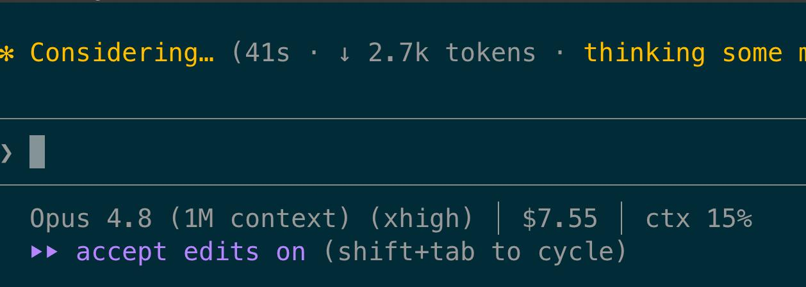
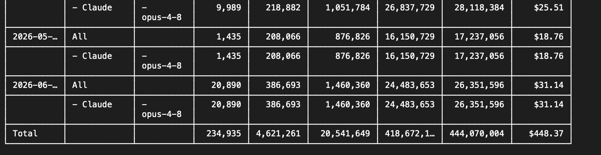

# Watching the cost

[Chapter 14](14-tokens-and-costs.md) showed that an agent's cost is invisible by default. It adds up turn after turn, and a session left running can spend far more than you intended, so the advice was to run `/cost` regularly to see how much the session had already spent. If you don't, you might get unlucky, like the team that left two agents looping for eleven days and came back to a bill tens of thousands of dollars higher than expected.

That was two agents on a single team. The same thing happens at the largest companies, on a much bigger scale: [Uber](https://fortune.com/2026/05/26/uber-coo-ai-spending-tokens-claude-code/) burned through its entire 2026 budget for AI coding tools in just four months.

In both cases the cost climbed faster than anyone was watching.

## The meter you don't have to ask for

You can see the spend with `/cost`, but you have to remember to run it, and a check you have to remember is a check you will skip.

Claude Code can show the running cost in a status line at the bottom of the screen, updated on every turn. Mine looks like this:



The `$7.55` is everything this session has cost so far, and it goes up as I keep working. I never type a command to see it, because it is always there at the bottom of the screen.

When you drive, you do not pop the hood to check the oil or dip the tank for fuel. You glance at the gauges and react. The cost meter is the same: always in front of you, no command to run. Turn it on by default, in every project, for everyone. It costs nothing to show, and it fixes the one problem with `/cost`, which is that you have to remember it exists.

The status line is a small script you control, so it can do more than show a number. You can have it change colour as the cost climbs: mine turns the figure yellow once a session passes $30 and red once it passes $50. The colour catches your eye, so you notice without having to read the number, and when it goes red you stop and look at what the agent is doing.

You do not have to write the script yourself. Paste this into a Claude Code session and it will fetch my version, explain in plain language what it does and what installing it changes, and set it up only if you agree:

```
Fetch this status line script: https://gist.github.com/sharovatov/082362b3b7c0023566e0e468f64fcd64

1. Read it and explain to me, in plain language, what it does and what each part is for. I am not a programmer.
2. Tell me exactly what installing it would change on my machine.
3. The script turns the cost yellow, then red, at two dollar amounts. Ask me what those should be for my budget.
4. If I agree, install it with my amounts: save it to ~/.claude/statusline.sh, make it executable, and register it as my status line in ~/.claude/settings.json without touching my other settings. Then show me how to check it works.
```

Making Claude explain the script before it installs is the same habit [chapter 12](12-using-skills.md) urged for skills: read what you are about to run, then decide.

One caveat applies for subscription users. On a subscription you do not pay per token, so the dollar figure is not a real bill: it is what the session would have cost on the API, not money leaving your account. Your real limit is the plan cap, not the dollar amount. The figure is still useful as a relative gauge of how hard a session is working, but read it as a burn rate, not a bill.

## Beyond one session

The status line only knows the session in front of you, and each new session starts from zero. It cannot tell you what you spent today, this week, or this month.

What you want is a tool that reads your usage across all sessions. [ccusage](https://github.com/ryoppippi/ccusage) does exactly that. It reads the local JSONL files Claude Code already writes under `~/.claude/projects/`, with no login required, and reports cost and token usage by day, week, month, and session. `ccusage blocks` reports against Claude Code's 5-hour billing window, which is the one that matters if you are on a subscription and want to see how close you are to the cap.

Here is its daily report, run on my own usage:



ccusage is someone else's tool, so [chapter 12](12-using-skills.md)'s rule applies: read it before you trust it. The prompt below makes Claude do that for you: it explains what ccusage reads and whether it sends your data anywhere before it installs or runs anything. As with the status line, the dollar figures are estimates for subscription users: what the usage would have cost on the API, not your actual bill.

To run it on your own usage, paste this into a Claude Code session:

```
I want to see how much I have spent in Claude Code, broken down by day. There is a tool called ccusage (https://github.com/ryoppippi/ccusage) that reads this from Claude Code's local logs.

1. Explain in plain language what ccusage is and exactly what it reads on my machine. I am not a programmer.
2. Tell me whether it sends any of my data elsewhere, and whether running it is a security risk.
3. Set it up and run it for me. If my machine is missing anything ccusage needs to run, tell me what that is in plain terms, and install it the simplest way once I agree. Then show me my daily usage and total, and walk me through the numbers.
4. Finally, tell me how to use it myself from now on, with the exact commands to type.
```

For teams, Claude Code can export its usage as OpenTelemetry metrics into a monitoring dashboard (turned on with the `CLAUDE_CODE_ENABLE_TELEMETRY` setting), and the Anthropic Console shows spend across a whole account or organisation. It is the same path any company takes with a cost it cares about: a number on one screen, then a shared dashboard the team can watch. Setting it up is engineering work; as a non-engineer, ask whoever runs your team's tooling to turn it on, or to give you access to the dashboard they already have.

## Nothing climbs unseen

Watching the cost does not lower it; it removes the surprise. The status line catches a runaway within the session, ccusage catches the slower drift across the week, and either way the spend shows up while you can still do something about it. The bills that surprise people are the ones nobody was watching.

---

Previous: [Change one thing at a time](15-change-one-thing-at-a-time.md)
