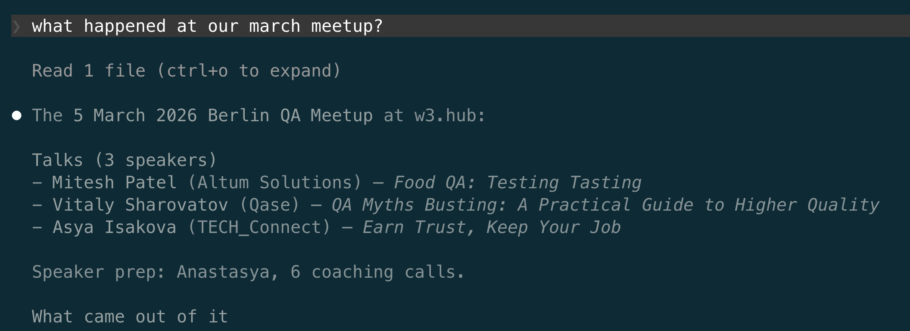
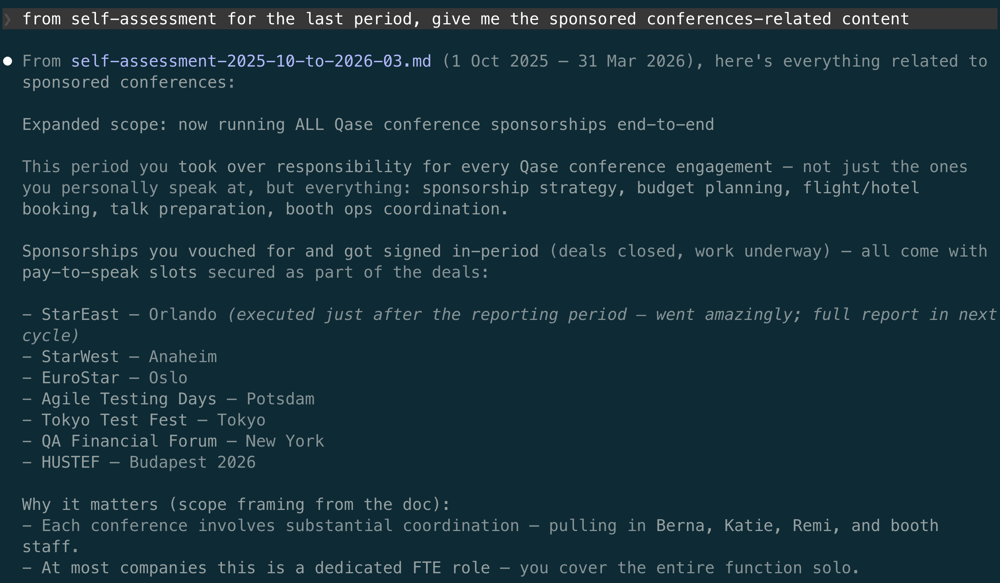
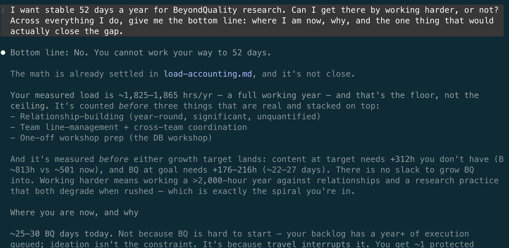

# Analysing your own work

Like many companies, mine runs performance reviews, which means that every six months I have to write a self-assessment.

To write it properly, I have to reconstruct six months of work. I have tried doing that the thorough way, back when this work was scattered across separate tools: querying Jira, searching my email, digging through Notion, then reconciling all of it into one picture. It took hours, and the slow part was not the searching. It was remembering where each thing lived before I could even go looking for it. The other option was to write it from memory, which was faster but left out half of what I did.

The obvious fix is to keep notes as I go. But good notes are their own job. They take time to write while I am trying to do the actual work, they drift out of whatever structure I started them in, and keeping them usable means reorganising them almost as often as I add to them.

Engineers hit this same wall in product development, where keeping a system understandable over years depends on knowing what was decided, why, and when. Their fix is the [architecture decision record](https://www.cognitect.com/blog/2011/11/15/documenting-architecture-decisions): a short file, kept with the project, that records each decision and the reason behind it. But an ADR is the same extra job as any note. Writing one well takes time you would rather spend on the work itself, so in practice only a few decisions ever get one, and the reasoning behind the rest is lost just as it always was.

This cycle I reconstructed nothing and kept no notes. I pointed the agent at the period and it pulled everything that happened from the files and the commit history. The record was already there, because it is where the work had happened all along.

It works because the agent takes on the one cost that made notes and ADRs fail: the writing. I do not stop to record anything; the agent does it while we work. Our discussion is saved word for word ([chapter 10](10-global-memory.md)), the decisions and the reasons behind them go into the same files as the work itself ([chapter 6](06-setting-up-a-folder.md)), and every output stays traceable to the discussion that produced it. This is the whole deliberation, not the few decisions an ADR captures, and it costs me nothing to keep.

The folder has a second layer too. Because I commit the changes myself ([chapter 7](07-git.md)), every accepted change is stamped with a date. The files tell me what I did; the dates tell me when. They do not tell me how long I worked (calendar time is not work time), but they tell me how long the work took to go from one step to the next. I can watch a process get faster: the gap between me finishing a video and Torben posting it on LinkedIn went from a week to two days once we fixed the handoff. That is exactly the kind of change a self-assessment is meant to capture, and I never recorded it on purpose. It accumulated as a side effect of working this way, and every entry is something I reviewed before it was saved, so the history is signal, not noise.

That folder is the only source of truth I keep. The markdown files are where the work actually lives: the budgets, the plans, the work-in-progress lists. When other people need to see what I am doing, my manager most of all, I generate a view from those files and push it to Notion, so Notion shows the work without being the place the work happens. Everything else I used to depend on is gone: no separate to-do list, no task tracker like Jira or Asana, no agenda handed to me by email notifications. There is one place to look, and it is the same place the analysis reads from.

At the smallest scale, that is one question answered from one file. I asked the agent what happened at the Berlin meetup in March, and it read that one event's file and gave it back: who spoke and on what, the coaching that went into their talks, and what came out of it.

The line above the answer says it read one file, and that was all it needed. This is the tactical scale earlier chapters worked at. The rest of this chapter does the same at a scale no memory reaches: not one file but all of them, not one event but six months.

## What I do with it: the performance review

When the review comes round, I do it in three passes.

First, the raw dump: meetups run, conferences sponsored, talks given, articles published, research shipped, videos recorded, pulled from the period with no structure, just what the files and the commit history hold.

Second, structure. I have the agent sort the dump into the categories the review actually asks about: writing, speaking, community, research, internal tooling, pipeline influence.

Third, the answer. The review asks its usual questions, about achievements, failures I learned from, and how the company can support me. With the structured record in front of me, I answer them.

The assembled report runs to five pages. The screenshot below is one slice of it, everything tagged to sponsored conferences, pulled out on request:

And because each period's self-assessment is itself a dated file in the record, I never start the next one from a blank page. The agent reads the last cycle beside this one and shows me the two together: where the numbers grew, which of last time's 'areas to improve' the record shows I acted on, and which I did not. Comparing myself to myself, period over period, is something memory cannot do. The record turns it into a question I can ask.

## What I do with it: deciding what to delegate

The self-assessment changed what I wanted from the next period. BeyondQuality, the deep research that feeds my talks and writing, is the part of my work that matters most, to me and to the community it serves. With the whole six months in front of me, I knew I wanted to give it at least twice the time going forward. I was also overloaded, and the company had suggested hiring someone to take some of the load off me. Before I asked for that, I wanted the real picture, starting with the bluntest question I had: could I just work harder?

Answering it meant understanding where my time actually goes and what each part of the job costs me. That is job analysis, and in HR it is a heavy process. Records show what was produced, not how the work is done, so to see the how, someone studies your past output and shadows you for weeks. My record already held the how, captured while I worked. There was nothing to shadow: the analysis was a restructuring of what was already there, and I was the one deciding what it meant.

I had the agent build the total up activity by activity. Some hours were already in the files, like the one-hour speaker-prep meetings. Some it asked me to estimate as we compiled. Where the commit history showed how often a task recurred, or how long it ran between steps, that informed my estimate. The agent never read it as a stopwatch. I confirmed every number, then it weighed the total against my goal of 52 days a year on BeyondQuality.

The answer was no. The work already fills a full working year, before BeyondQuality reaches its target and before relationship-building and team work are counted at all. That overload is the kind of thing that is easy to feel and impossible to argue with until it is on the page in hours. You cannot add your way to a goal when there is no time left to add. The only lever is removing load.

So I had the agent work through every activity again, to find what I no longer needed to do myself. It interviewed me on each one, filling a fixed shape: what the activity is, what would break if I handed it off badly, and the call I made (keep it, delegate it now, automate it, or hire and train for it). For anything I marked delegable, it asked one more question: would handing it off merely save me time, or would it raise the quality of the result? It compiled the separate files into one document with a small script ([chapter 11](11-skills-not-instructions.md)), so I can regenerate the whole analysis whenever the underlying files change.

The output was a delegation plan grounded in evidence: these specific hours can be taken off me, the freed time almost exactly covers the gap I needed to close, and here is what has to be true for quality to survive each handoff. That is a different conversation with a manager than "I am busy".

## The agent assembles, you judge

This chapter could read as if the agent evaluates my work. It does not, and it must not, for the same reason every earlier chapter gives.

The data is trustworthy because I produced it: I wrote the files, I reviewed each change in the diff, and I committed it ([chapter 7](07-git.md)). The synthesis is a different thing. A self-assessment or a delegation plan that the agent composes is LLM output like any other, and the LLM is non-deterministic ([chapter 1](01-what-is-an-llm.md)). It can miscount, over-weight a busy month, or phrase a judgment I never made. So I verify it against the record, the same way I verify every other change.

The agent aggregates. I judge, and I am the one accountable for the result ([chapter 9](09-risks.md)). It does not decide that I performed well, or that a colleague should take over the meetups. It lays the evidence out so that I can.

## The payoff

This is the benefit I would now refuse to give up. For the first time I can see the whole shape of my own work, six months of it at once, and decide what to keep, drop, or hand off from evidence instead of memory. I did not set out to gain it, and there was no extra step to build it. It is what the rest of this book produces when you follow it: one agent per area of responsibility ([chapter 5](05-one-agent-one-job.md)), everything kept in its folder ([chapter 6](06-setting-up-a-folder.md)), every change committed and reviewed ([chapter 7](07-git.md)), the work and the discussion written to files instead of left in a chat that disappears ([chapter 10](10-global-memory.md)). Do that, and the record is already there. It would have been worth the discipline on its own.

---

Previous: [Watching the cost](16-watching-costs.md)
