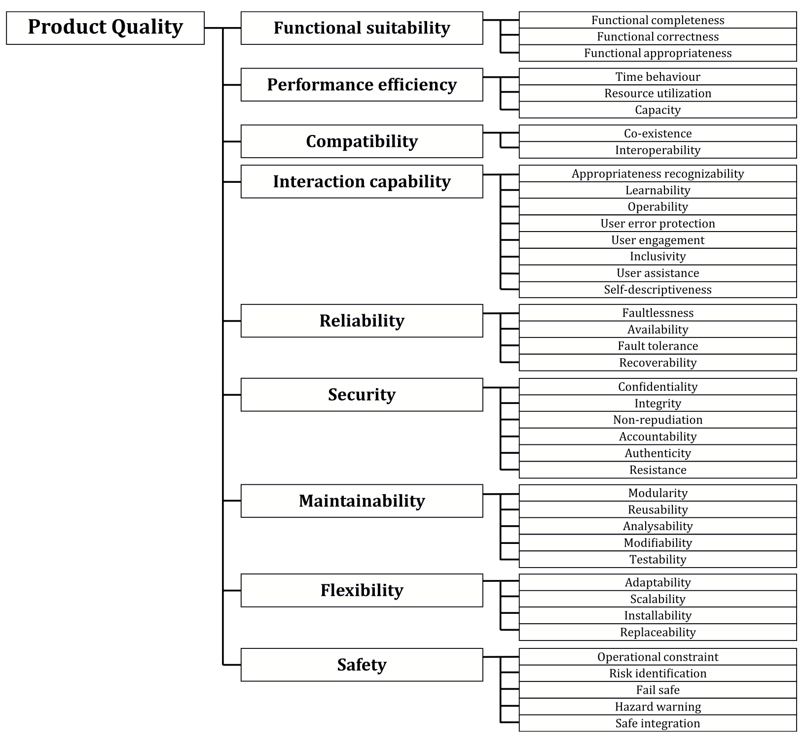
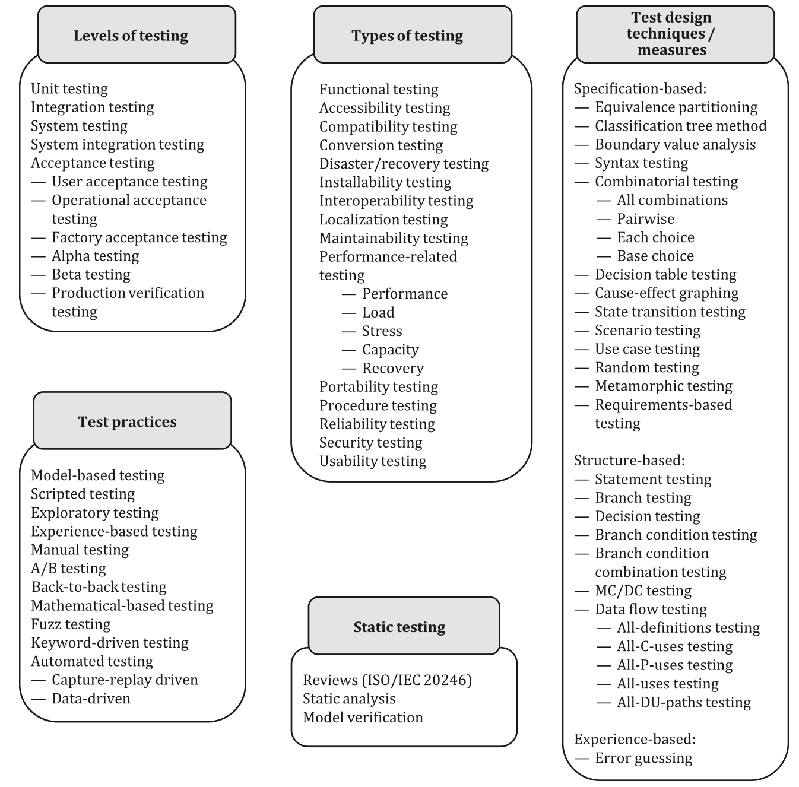

# Economics of testing

## Testing as a risk-mitigation investment

Testing is an appraisal activity that provides information about risks and reduces their likelihood or impact when failures are found and fixed.

Like any other activity, testing consumes resources (effort, tools, and time).

In economics, investment is defined as "_any asset obtained at a cost, on the expectation that it will deliver future value greater than its initial cost._".

Testing fits into this definition: it is an investment made today to reduce the probability and impact of costly failures tomorrow, thereby optimizing future outcomes.

Since testing is an investment, its economic return can never be guaranteed. At best, we can estimate the expected benefits, but the value of testing lies in reducing the probability and impact of costly failures, and these events may or may not occur. Testing can be compared to insurance or preventive healthcare: we spend resources today because the risks of not doing so are far greater than the cost of investment.

Recognizing that we do need to invest, the next question becomes where to allocate those resources. Budgets are never limitless, and the law of diminishing returns means that simply "doing more testing" is not an efficient strategy. Instead, we must treat testing like an investment portfolio: selecting a mix of testing activities that provides the maximum reduction in risk for the resources available.

To build such a portfolio, we must first identify which risks matter most. ISO/IEC/IEEE 29119 makes this explicit: risk identification is the first step in test planning. Similarly, ISO/IEC 25010 provides a structured set of quality characteristics that can serve as categories for defining risk areas. By starting from risks, we can then make deliberate, economically sound decisions about which testing activities to invest in and to what extent, ensuring that the portfolio aligns with the organization’s tolerance for risk and its business priorities.

These risks failure can be understood as the risks of not meeting one or more quality characteristics (see Figure 1). ISO 25010 defines nine groups of such characteristics, and for every product and at every stage of its lifecycle these groups will vary in importance.

Figure 1: Quality Characteristics

Once risks (not meeting certain quality characteristics) are prioritized, we gain clarity on _where_ to invest: which risks we need to reduce most, and which can be given less attention. For example, in an early prototype, flexibility and maintainability may carry little risk, while for a production system they become critical.

The question of _how_ to invest is more complex. Every testing level, type, and measure (see Figure 2) affects multiple risks at once, and in different ways. Overlaps are inevitable: the same activity may mitigate several risks, while different activities may address the same risk. This overlap is not a flaw but a feature and it provides safety margins. What must be avoided is underlap, where some risks remain uncovered. Since no investment can guarantee complete risk elimination, in practice it is often better to do _slightly more_ than strictly necessary, rather than fall short: from a risk management perspective, it's rational to "slightly over-invest" (better redundancy than a gap).

Figure 2: Testing types, activities and measures:

**NB**: There are mandatory standards for testing in certain industries. For instance, DO-178C for aviation, ISO 26262 for automotive industry, and IEC 62304 for medical device software.

None of the ISOs I have studied provide a mapping between quality characteristics and testing types, activities and measures. This poses a problem, and experts's knowledge is the only solution at this stage. On later stages, when some investments are done, we can assess the investment portfolio optimality.

**[mention the survey and its results]**

**TODO** elaborate on how to choose testing approaches (estimated costs [knowledge and skills => estimated effort)

The prioritised list of testing approaches defines the testing strategy for the identified and prioritised risks. These are currently akin to expert-based investment choices.

As with any investment, however, it is not enough to simply allocate resources, we also need a way to verify whether those choices are delivering value. This requires a structured approach to reviewing and assessing the efficiency of our testing portfolio: if our expert choices and estimations were good.

## Assessing the portfolio efficiency

Once a testing strategy has been defined, we must plan for its evaluation. Just as investors periodically review their portfolios, organizations need to reassess whether their chosen mix of testing approaches continues to reduce the most important risks in a cost-effective way.

Two questions frame this evaluation: when to review the strategy, and how to measure its efficiency. The first ensures that assessment is built into the life cycle rather than left to a _postmortem_ when a risk has occurred; the second provides the criteria and metrics to determine whether the strategy is delivering sufficient return on investment.

In practice, evaluation can be guided by a simple structure that addresses both when to review and how to measure. The outline below shows example evaluation areas, triggers, and metrics. 

NB: these are only illustrations. Every product, team, and organization has its own context, so the actual contents of this table must be recreated for each case. What matters is not adopting someone else's metrics wholesale, but ensuring that the chosen evaluation criteria reflect your risks, priorities, and tolerance for investment.

| Evaluation Area | Example Triggers / Metrics | Purpose |
| --------------- | -------------------------- | ------- |
| When to review  | 1. Scheduled cadence (per release, quarterly, semi-annual) 2. Event-driven (architecture change, new risks, regulatory shift) 3. Early-warning signals (spike in escaped defects, increased customer complaints, delivery slowdowns) | Ensures the portfolio is reassessed regularly and reactively when risk context changes. |
| Outcome effectiveness | 1. Defect containment (pre-release vs. post-release)- 2. Severity-weighted defect density 3. Cost of quality (prevention/appraisal vs. failure) 4. Customer impact (support tickets, churn, NPS) | Determines if the testing investment actually reduced critical risks. |
| Efficiency of portfolio | 1. Test effort vs. coverage balance 2. Lead time for change / delivery speed 3. Redundancy vs. gaps (overlap vs. underlap in risk coverage) 4. ROI proxy (testing cost vs. avoided rework cost) | Shows whether resources are being optimally allocated across testing approaches. |

## Resources

- [ISO/IEC/IEEE 29119-1:2022 Software and systems engineering — Software testing](https://www.iso.org/standard/81291.html)
- [ISO/IEC 25019:2023 Systems and software engineering — Systems and software Quality Requirements and Evaluation (SQuaRE) — Quality-in-use model](https://www.iso.org/standard/78177.html)
- [Investments](https://www.financestrategists.com/wealth-management/investments/)
