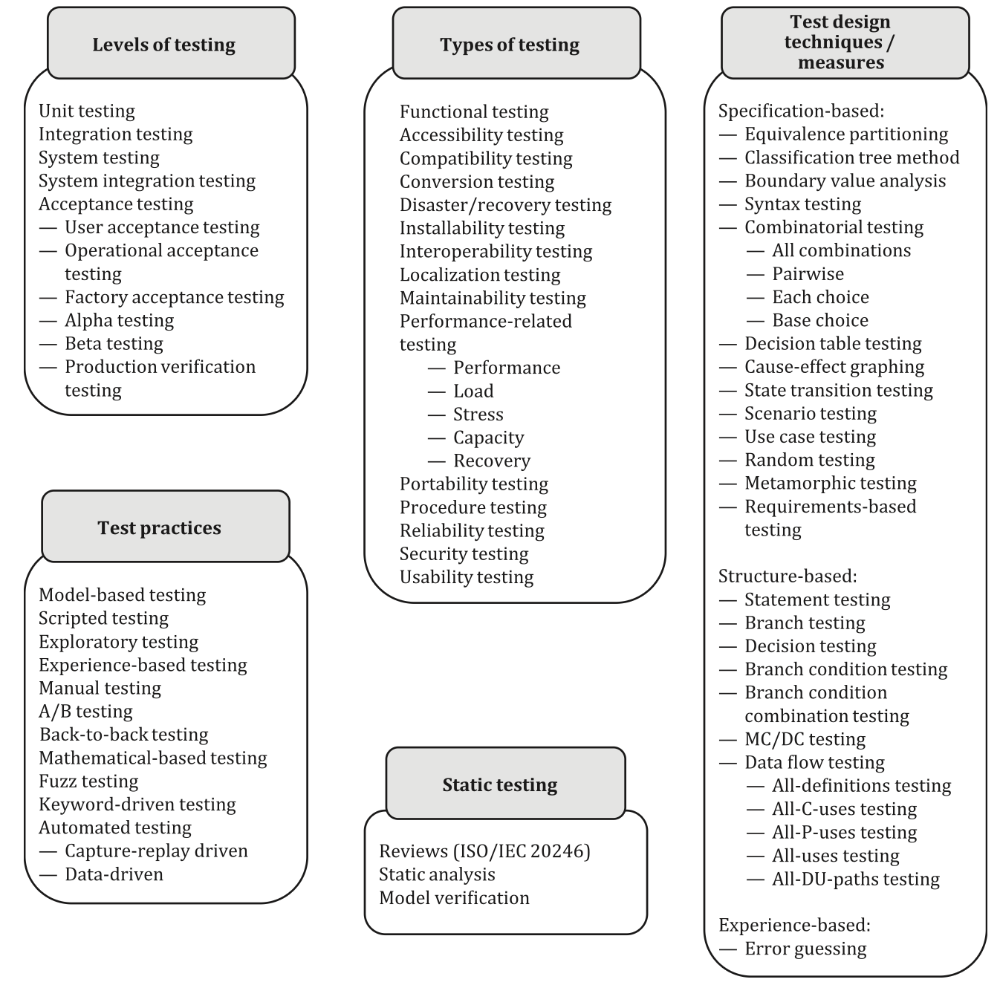

# Economics of testing

## Testing as a risk-mitigation investment

Testing is an appraisal activity that provides information about risks and reduces their likelihood or impact when failures are found and fixed.

Like any other activity, testing consumes resources (effort, tools, and time).

In economics, investment is defined as "_any asset obtained at a cost, on the expectation that it will deliver future value greater than its initial cost._".

Testing fits into this definition: it is an investment made today to reduce the probability and impact of costly failures tomorrow, thereby optimizing future outcomes.

Since testing is an investment, its economic return can never be guaranteed. At best, we can estimate the expected benefits, but the value of testing lies in reducing the probability and impact of costly failures, and these events may or may not occur. Testing can be compared to insurance or preventive healthcare: we spend resources today because the risks of not doing so are far greater than the cost of investment.

Recognizing that we do need to invest, the next question becomes where to allocate those resources. Budgets are never limitless, and the law of diminishing returns means that simply "doing more testing" is not an efficient strategy. Instead, we must treat testing like an investment portfolio: selecting a mix of testing activities that provides the maximum reduction in risk for the resources available.

To build such a portfolio, we must first identify which risks matter most. ISO/IEC/IEEE 29119 makes this explicit: risk identification is the first step in test planning. Similarly, ISO/IEC 25010 provides a structured set of quality characteristics that can serve as categories for defining risk areas. By starting from risks, we can then make deliberate, economically sound decisions about which testing activities to invest in and to what extent, ensuring that the portfolio aligns with the organization’s tolerance for risk and its business priorities.

These risks failure can be understood as the risks of not meeting one or more quality characteristics (see Figure 1). ISO 25010 defines nine groups of such characteristics, and for every product and at every stage of its lifecycle these groups will vary in importance.

Figure 1: Quality Characteristics

Once risks (not meeting certain quality characteristics) are prioritized, we gain clarity on _where_ to invest: which risks we need to reduce most, and which can be given less attention. For example, in an early prototype, flexibility and maintainability may carry little risk, while for a production system they become critical.

The question of _how_ to invest is more complex. Every testing level, type, and measure (see Figure 2) affects multiple risks at once, and in different ways. Overlaps are inevitable: the same activity may mitigate several risks, while different activities may address the same risk. This overlap is not a flaw but a feature and it provides safety margins. What must be avoided is underlap, where some risks remain uncovered. Since no investment can guarantee complete risk elimination, in practice it is often better to do _slightly more_ than strictly necessary, rather than fall short: from a risk management perspective, it's rational to "slightly over-invest" (better redundancy than a gap).

Figure 2: Testing types, activities and measures:

**NB**: There are mandatory standards for testing in certain industries. For instance, DO-178C for aviation, ISO 26262 for automotive industry, and IEC 62304 for medical device software.

None of the ISOs I have studied provide a mapping between quality characteristics and testing types, activities and measures. This poses a problem, and experts's knowledge is the only solution at this stage. On later stages, when some investments are done, we can assess the investment portfolio optimality.

**[mention the survey and its results]**

**TODO** elaborate on how to choose testing approaches (estimated costs [knowledge and skills => estimated effort)

The prioritised list of testing approaches defines the testing strategy for the identified and prioritised risks. These are currently akin to expert-based investment choices.

As with any investment, however, it is not enough to simply allocate resources, we also need a way to verify whether those choices are delivering value. This requires a structured approach to reviewing and assessing the efficiency of our testing portfolio: if our expert choices and estimations were good.

## Assessing the portfolio efficiency

Once a testing strategy has been defined, we must plan for its evaluation. Just as investors periodically review their portfolios, organizations need to reassess whether their chosen mix of testing approaches continues to reduce the most important risks in a cost-effective way.

Two questions frame this evaluation: when to review the strategy, and how to measure its efficiency. The first ensures that assessment is built into the life cycle rather than left to a _postmortem_ when a risk has occurred; the second provides the criteria and metrics to determine whether the strategy is delivering sufficient return on investment.

In practice, evaluation can be guided by a simple structure that addresses both when to review and how to measure. The outline below shows example evaluation areas, triggers, and metrics. 

NB: these are only illustrations. Every product, team, and organization has its own context, so the actual contents of this table must be recreated for each case. What matters is not adopting someone else's metrics wholesale, but ensuring that the chosen evaluation criteria reflect your risks, priorities, and tolerance for investment.

| Evaluation Area | Example Triggers / Metrics | Purpose |
| --------------- | -------------------------- | ------- |
| When to review  | 1. Scheduled cadence (per release, quarterly, semi-annual)  2. Event-driven (architecture change, new risks, regulatory shift)  3. Early-warning signals (spike in escaped defects, increased customer complaints, delivery slowdowns) | Ensures the portfolio is reassessed regularly and reactively when risk context changes. |
| Outcome effectiveness | 1. Defect containment (pre-release vs. post-release)  2. Severity-weighted defect density  3. Cost of quality (prevention/appraisal vs. failure)  4. Customer impact (support tickets, churn, NPS) | Determines if the testing investment actually reduced critical risks. |
| Efficiency of portfolio | 1. Test effort vs. coverage balance  2. Lead time for change / delivery speed  3. Redundancy vs. gaps (overlap vs. underlap in risk coverage)  4. ROI proxy (testing cost vs. avoided rework cost) | Shows whether resources are being optimally allocated across testing approaches. |

## Adjusting the portfolio

Evaluation is not the end of the process but a feedback loop. As with financial portfolios, when risks, priorities, or results change, the mix of testing activities may need to change as well. Resources should be shifted toward approaches that prove effective, reduced where returns are low, or reallocated to new activities as new risks appear. 

**Testing strategy is not a one-time design but a continuous cycle of investment, review, and adjustment.**

---

# Complete Testing Taxonomy

This document aims to provide full taxonomy of testing types, levels, approaches and methods.

## Introduction

Testing is one of the few engineering activities that directly determines whether a company **survives or collapses**.

When testing fails, it’s not just bugs that slip through. This failure might incur financial, operational, and reputational damage that will devastate the entire organization.

Consider just a few examples:

- In 2012, a simple regression error in automated trading software caused Knight Capital a $400 million loss in 45 minutes.

- In 2024, an untested update of CrowdStrike software triggered a global outage across millions of Windows systems, wiping out an estimated $10 billion in market value.

- In 2024, insufficient testing of the Boeing MCAS control logic and its integration contributed to cascading safety issues and losses exceeding $60 billion in market capitalization and penalties.

Each of these disasters stemmed from inadequate or misdirected testing, whether from missing test coverage, flawed test design, or a misunderstanding of what "kind" of testing was needed.

Despite testing’s existential importance, the discipline itself remains conceptually tangled. Teams often confuse types with levels, approaches with strategies, and techniques with tools. The result is predictable: suboptimal testing strategies that waste resources, duplicate effort, or fail to prevent the most critical risks.

This article aims to untangle that confusion.

It provides a structured map of software testing, explaining how various testing concepts, from unit to chaos, from shift-left to risk-based, fit together.

# Understanding the Foundations: What Do We Mean by "Testing"?

Testing is often described as a technical or procedural activity: running checks, writing test cases, or executing suites. But fundamentally, testing is an economic and risk-management function.

[to read more, examine our study on the economics of testing](https://beyondquality.org/research/testing_economics/testing_economics)

> **TL;DR:** the process is simple: we identify and prioritize risks -> pick where to test (levels) -> pick what quality to target (types mapped to QCs from ISO/IEC 25010) -> pick how to design tests and how much to cover (techniques + measures) -> choose how we’ll work (practices) -> balance static and dynamic work.

Only when we see testing through this economic lens, does it become clear why we need different levels, types, approaches, and strategies: each addresses distinct classes of risks.

**NB**: This article uses ISO 29119 (software testing) together with ISO 25010 (quality model) as its backbone. Part 1 of 29119 defines concepts and terminology; Part 2 defines the test processes; Part 3 the documentation; Part 4 the test design techniques (aka test methods); Part 5 covers keyword-driven testing. Static reviews are defined in ISO/IEC 20246.

# Complete Testing Taxonomy

ISO 29119 organizes testing along several dimensions that you mix‑and‑match when you write a test strategy.

1. Static vs Dynamic
2. Test Levels
3. Test Types
4. Test Design Techniques & Coverage
5. Test Practices
6. Risk-based Strategy

### 1. **Dynamic vs. Static testing**

First, there's a big distinction between dynamic and static testing.

Static testing implies evaluating software without execution, for instance:
- code reviews/inspections (ISO 20246),
- SAST/linters,
- architecture/design/protocol/contract/spec reviews,
- formal/spec/model verification.

"Static" and "dynamic" testing are fundamentally different ways of _producing test evidence_: different when, what, how much, and how costly. Static testing implies examination without executing the software; dynamic testing implies executing the system to _observe behavior_.

Static testing needs only artifacts like requirements, designs, code, configs, or models, so you can act weeks earlier; dynamic testing requires a working product. Static excels at catching insecure coding patterns, dependency issues, unreachable states, and missing requirements, while dynamic is the only way to see emergent behavior, such as runtime integration faults, concurrency/timing issues, performance under load, real security exposures, and UX problems, etc.

The split is economic as well. Defects removed in reviews or static analysis are typically far cheaper than those found after assembly or deployment.

Also, in many regulated or safety-critical contexts, compliance often mandates specific static activities (coding-rule conformance, threat modeling, formal reviews) in addition to dynamic tests.

All testing activities which imply executing the system fall into dynamic testing category.

### 2. Test levels (where in the lifecycle?)

Test level categorises where tests are written in the system hierarchy/lifecycle (unit -> integration -> system -> acceptance).

Different levels expose different fault classes: unit/component work is best at catching local logic errors and boundary conditions; integration/contract work reveals interface and protocol mismatches; system testing exposes end-to-end behavior, configuration, and cross-cutting concerns; acceptance/field testing validates suitability for users, operations, and regulations. Keeping these levels distinct speeds feedback where it’s cheapest (lower levels) and reserves slower, costlier runs for risks that only appear at higher scopes.

The separation also improves fault localization and containment (failures found at a defined level are easier to trace and prevent from "escaping" upward), supports budgeting and scheduling (you can invest more in fast, cheap levels and right-size expensive ones), clarifies ownership and handoffs (devs generally own unit/contract, cross-team groups own system/system-integration, product/ops/customers own acceptance), and dictates the right environments and test doubles (mocks/stubs at unit, real contracts/fixtures at integration, production-like data/topology at system and acceptance). It also enables parallelization and CI gates (explicit entry/exit criteria per level), makes coverage and traceability interpretable (map each requirement/risk to the lowest effective level and choose techniques accordingly), satisfies compliance obligations that demand evidence at specific levels (e.g., FAT/SAT/OAT, UAT sign-off), and reinforces risk-based selection so teams don’t try to catch everything with slow, brittle end-to-end tests.

Typical test levels:
- [unit](https://qase.io/blog/unit-testing/)
- [component](https://qase.io/blog/component-testing-a-complete-guide/)
- [component-integration](https://qase.io/blog/integration-testing/)/contract
- system
- [system-integration](https://qase.io/blog/system-integration-testing-sit/)
- [acceptance](https://qase.io/blog/acceptance-testing/) ([UAT](https://qase.io/blog/user-acceptance-testing-uat/)/OAT/FAT)
- [alpha/beta](https://qase.io/blog/alpha-testing-vs-beta-testing/) (field)

Additionally to test levels defined in ISO, there're two popular industry extensions:
- [End-to-end](https://qase.io/blog/end-to-end-testing/) testing is most often done at the system level
- [api testing](https://qase.io/blog/a-comprehensive-guide-to-api-testing-best-practices-tools-challenges-and-more/) is most often done treating the whole API as a separate level spanning component and system levels.

### 3. Testing types (what are we testing for, which quality characteristic?)

A testing type answers _what quality are we testing for_? It targets a quality characteristic from ISO 25010 (e.g., performance efficiency, security, usability, reliability). Many types can be exercised at multiple levels (unit, integration, system, acceptance) and with different techniques (spec-based, structure-based, experience-based), and via static or dynamic activities.

ISO treats testing types as a first-class category to keep _the what_ separate from _the where_ and _the how_: 
- testing type = _the what_ — quality goal
- testing level = _the where_ — unit/integration/system/acceptance, etc.
- testing techniques/practices = _the how_

That separation prevents traps like "performance = only E2E" or "security = pen-test only", makes risks explicit and comparable (types map cleanly to risk classes such as data breach, SLO breach, operability, accessibility), and lets you prioritize without arguing about tools or environments.

**Quality characteristics (ISO 25010)**: functional suitability, performance efficiency, compatibility (incl. interoperability), usability, reliability, security, maintainability, portability, and quality-in-use characteristics in the SQuaRE family.

**Testing types**:

- [Functional testing](https://qase.io/blog/functional-testing/)
- Accessibility testing
- Compatibility testing
- Conversion testing
- Disaster/ recovery testing
- Installability testing
- Interoperability testing
- Localization testing
- Maintainability testing
- Performance-related testing
	- [Performance testing](https://qase.io/blog/performance-testing/)
	- Load
	- [Stress testing](https://qase.io/blog/stress-testing-software/)
	- Capacity
	- Recovery
- Portability testing (and [cross-browser testing](https://qase.io/blog/cross-browser-testing/))
- Procedure testing
- Reliability testing (and [chaos testing](https://qase.io/blog/chaos-testing/))
- Security testing
- Usability testing

### 4. Test design techniques & measures (how to design the cases, how to measure coverage?)

A test design technique states how you _derive tests_ and _how much you aim to cover_.

Each technique has a clear input (the model/test basis), a repeatable procedure, and a coverage definition, and leaves _how you work_ (e.g., exploratory/model-based as practices) to other parts of the series. 

The techniques are grouped by their primary source of information: specification-based, structure-based, and experience-based.

**Specification-based ([black-box](https://qase.io/blog/black-box-vs-white-box-testing/))**:
- equivalence partitioning
- boundary-value analysis
- classification-tree method
- decision tables
- cause-effect graphing
- state-transition
- syntax testing
- combinatorial
	- all-combinations
	- pairwise
	- each-choice
	- base-choice
- scenario/use-case testing ([happy path testing](https://qase.io/blog/happy-path-testing/) falls in this category)
- random testing / [monkey testing](https://qase.io/blog/monkey-testing/)
- metamorphic testing
- requirements-based testing

**Structure-based (white-box)**:
- statement testing
- branch/decision testing
- MC/DC testing
- data-flow testing
	- all-defs testing
	- all-uses testing
	- all-DU-paths testing

**Experience-based**:
- error guessing (plus charters/tours under exploratory practice)

**Coverage measures (examples)**:
- Partition/Boundary coverage
- Decision-table rule coverage
- State/Transition coverage
- Pairwise/Combinatorial coverage
- Statement/Branch/Decision/MC-DC
- All-Defs/All-Uses/All-DU-Paths.

### 5. Test practices (how you work)

Practices are ways of organizing/executing testing (orthogonal to types/levels/techniques). Examples: exploratory vs scripted, model-based testing, manual vs automated, continuous testing/CI gating, back-to-back, A/B/experimentation, fuzz testing, keyword-driven testing (29119-5).

While test technique defines _how test cases are derived and what coverage means_; a test practice defines _how the work is organized and executed_, answering the questions like _who does testing_, _with what cadence_, _in which environment_, _using what orchestration_, _and how evidence is captured_.

Practices are structured as choices you can compose with any type, level, or technique.

Testing practices cover:
- **[exploratory](https://qase.io/blog/exploratory-testing/) vs scripted** for the style of design and execution
- **model-based testing; property-based and fuzz-style generation** for the role of models and generators_
- **manual, semi-automated, fully automated** for the degree of automation_
- **keyword-driven per ISO 29119-5; data-driven; BDD/specification-by-example** for the orchestration frameworks
- **on-commit/CI gating, nightly/[regression](https://qase.io/blog/regression-testing/), pre-release hardening, production-like or production with [canary](https://qase.io/blog/canary-testing/)/blue-green and A/B experimentation** for the delivery cadence and place

Keeping practices separate lets you, for example, run exploratory security sessions (experience-based techniques) this afternoon, automate model-based functional checks (spec-based techniques with state/transition coverage) in CI, and protect a release with canary guardrails (a practice at system/field scope), all without changing how you measure sufficiency for each technique. That composability is the point: pick _the what_ (testing type), _the where_ (testing level), _the how much_/_the how_ (technique + coverage), and then choose _the way of working_ (practice) that delivers the evidence efficiently.

Additionally to the practices defined in ISO standards, our industry has a few well-established "extensions":

- [Smoke testing](https://qase.io/blog/smoke-testing/) — a fast, breadth-first gate that answers "is this build even testable?"
- [Sanity testing](https://qase.io/blog/sanity-testing/) a narrow, change-focused confidence check after a fix or small update
- [regression suites](https://qase.io/blog/regression-suites/) are a practice/asset and selection strategy at the same time. They’re the maintained set that guards against re-introducing defects
- [bug bash](https://qase.io/blog/bug-bash/) is a practice (an event format rather) that typically uses exploratory techniques at the system or field-like scope
- [ad-hoc](testing https://qase.io/blog/ad-hoc-testing/) is a practice "label" for unstructured testing
- [gray box testing](https://qase.io/blog/gray-box-testing/) — an approach/practice describing knowledge of internals (between black-box and white-box)

### 6. Risk‑based test strategy (how you decide what to do)

A test strategy is simple in principle: start from risk, then choose the minimum set of activities that gives credible evidence that those risks are under control. In practice that means naming the risk, mapping it to an ISO 25010 quality characteristic (the type—_the what_), selecting the lowest effective level(s) where it can be detected or prevented (_the where_), and then picking test design techniques with explicit coverage targets (_the how much_/_how_). Only after that do you choose practices — exploratory or scripted, model-based or not, manual or automated, CI gating or canary — so the work is delivered efficiently. Balance static activities (reviews, analysis, models) with dynamic execution, and set measurable acceptance targets (SLOs, WCAG conformance, CVSS thresholds, availability/error budgets) so "done" is objective. 29119-2 embeds this selection into the process: define the test basis and risks, build or choose models, select techniques and coverage, plan environments and data, execute, and loop on the results.

## Resources

- [ISO/IEC/IEEE 29119-1:2022 Software and systems engineering — Software testing](https://www.iso.org/standard/81291.html)
- [ISO/IEC 25019:2023 Systems and software engineering — Systems and software Quality Requirements and Evaluation (SQuaRE) — Quality-in-use model](https://www.iso.org/standard/78177.html)
- [Investments](https://www.financestrategists.com/wealth-management/investments/)
